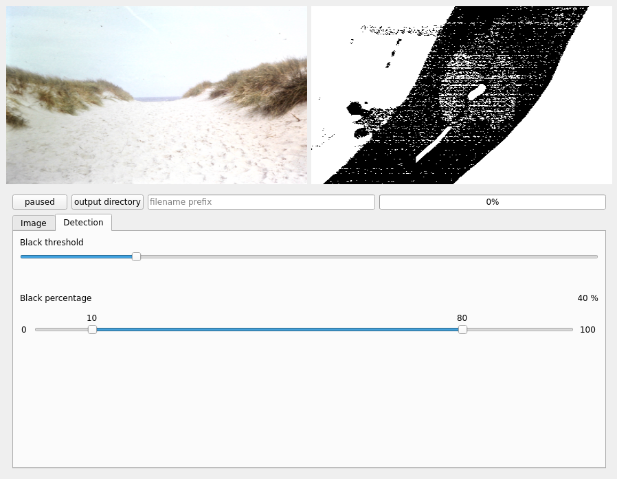

# diafilm

Diafilm is a small GUI utility to capture pictures from webcam based slide film scanners such as the SilverCrest Negative Digitiser SND 3600.

*It turened out to be more of a quick and dirty project, but might be useful to some in it's current state, so I decided to publish it nevertheless.*

## Installation

- clone this repository
- create a virtualenv: `python3 -m venv venv` and activate it: `. venv/bin/activate`
- install dependencies: `pip install -r requirements.txt`
- run the app: `python app.py`

## Features

- automatically detect movement to the next slide and capture the image after some waiting time (see [the last section](#how-the-next-slide-detection-works))
- save files in specified output dir, a subfolder named as written in text input field, and with an increasing file number

**Please note:** the file number counter resets to 1 whenever the subfolder name in the text input field is being changed

## Shortcuts

- `m`: mute/unmute camera shutter sound
- `s`: start/stop recording mode, in which files are actually saved to disk on automatically detected frame changes
- `t`: take picture: saves current frame to disk (independent of recording mode), the file number doesn't increase
- `r`: redo: the same as `t`, but the file number doesn't increase, effectively replacing the last take

## Changing the video input device

First find out, which webcam you want to use by running `v4l2-ctl --list-devices`. Then insert the number following `/dev/video<your number>` in `config.py`: `video_device = <your number>`

## Libraries used

Diafilm is a Qt Application written in Python using PySide6. Further dependencies are OpenCV2, pydub and superqt.

## How the "next slide" detection works

The image is converted to grayscale. Then a threshold (the first slider in the detection tab) is applied: everything below the threshold is converted to black, while everything above it is white (this is what is shown in the right frame when selecting the detection tab). The if the percentage of black pixels is within the configured "black percentage" range as specified by the second slider (e.g. between 20 % and 80 %) the frame is regarded as a "black" frame. Every frame from the camera is being analyzed. After a certain number of black frames (usually more than 2) and a following number of non-black frames (maybe 5, should be set according to how long the webcam takes to adjust brightness for a new slide) a new image is "taken" (these two numbers can be adjusted in the `_min_black_seq` and `_min_image_seq` variables in the `VideoAnalyzer` class in `videoworker.py`). A camera shutter sound will be played and the captured frame is shown in the left preview window.

**TLDR**: Adjust the first slider, so the picture is completely white and only the picture frame is shown as black (during transitions). Read the current black percentage (number on the right) during a transition and make sure it is in between the upper and lower values of the second slider.

If the detection still fails, you might be switching slides to fast. Per default, at least 2 "black" frames have to be detected during the transition, on the first non-black frame the progress bar counts up to 5 non-black frames and then the picture is taken.
